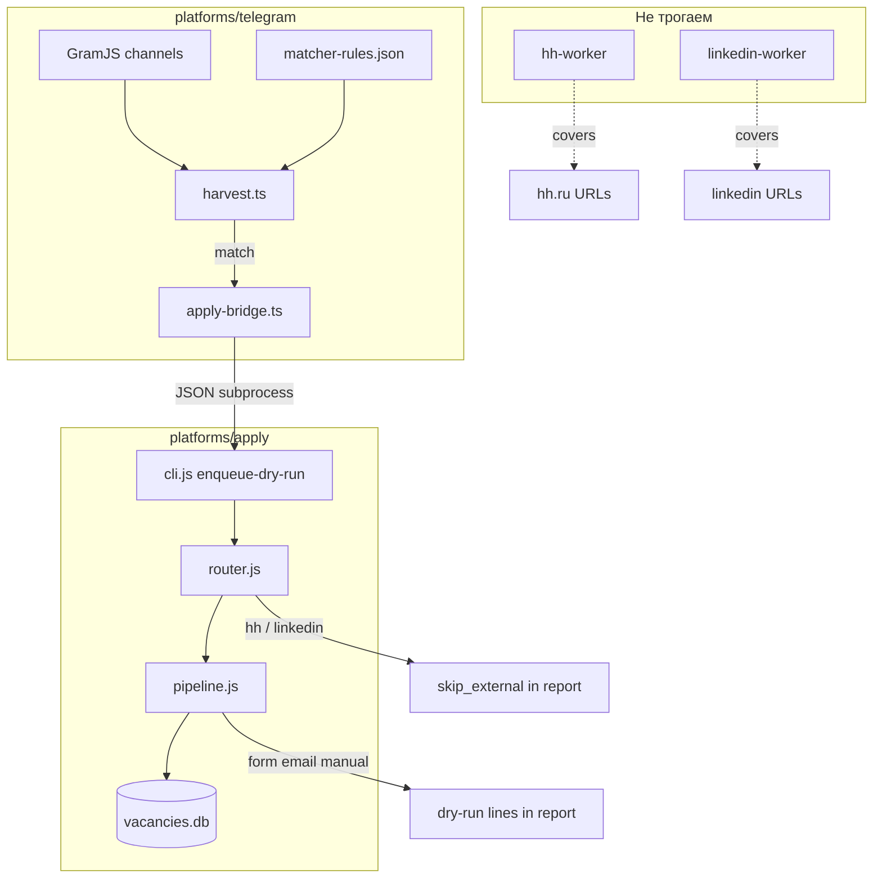

# Harvest auto-apply (dry-run) — design spec

**Дата:** 2026-06-28  
**Статус:** Approved (user)  
**Репозиторий:** `apply-hub` (ветка `it-ptitsa`)  
**Эволюция:** интеграция логики из `rvc-applicant` в apply-hub; HH/LinkedIn не трогаем.

---

## Цель

После Telegram harvest для **релевантных** постов (matcher) автоматически **классифицировать** вакансии по платформе (form, email, manual, …), **dedup** в SQLite и в **фазе 1** показывать в отчёте «Избранное», что *было бы* откликнуто — без реальных apply. HH.ru и LinkedIn по-прежнему обрабатывают `hh-worker` и LinkedIn worker; harvest только помечает их как skip.

---

## Решения пользователя

| Вопрос | Решение |
|--------|---------|
| HH / LinkedIn из harvest | **Нет auto-apply** — только note в отчёте |
| Оркестрация | **apply-hub** (не отдельный rvc-applicant daemon) |
| Старт автomation | **Dry-run first** (`APPLY_DRY_RUN=1`) |
| Код rvc-applicant | **Vendor `lib/`** в `platforms/apply/` |
| Вызов из Bun harvest | **Subprocess + JSON** (CLI bridge), не SQLite в Bun runtime |
| Релевантность фаза 1 | **`matcher-rules.json`** (harvest); `profile.yaml` / fit-score — позже |
| SSOT письма | **`letter.txt`** в корне apply-hub |

---

## In scope / Out of scope

| In scope (фаза 1) | Out of scope |
|-------------------|--------------|
| Vendor `platforms/apply/lib/` из rvc-applicant | Реальные отклики (фаза 2) |
| CLI `enqueue-dry-run` + JSON stdin/stdout | Playwright/SMTP integration tests на фазе 1 |
| Hook в `harvest.ts` после matcher match | Изменение hh-worker / LinkedIn orchestrator |
| Секция «Dry-run apply» в Saved Messages отчёте | Platform adapters (djinni, getmatch, habr) — фаза 3 |
| SQLite dedup/queue (`platforms/apply/data/vacancies.db`) | Buildin / sources.yaml registry |
| Unit + integration tests на границе router/enqueue/bridge | Fit-score как gate на фазе 1 |

---

## Архитектура



### Принципы

1. **Harvest не ломается:** ошибки apply-пайплайна логируются; отчёт harvest уходит без apply-секции, если subprocess/DB недоступны.
2. **Два dedup-слоя:** `.seen_store.json` — «уже показывали в harvest»; SQLite — «уже в apply-очереди / откликались».
3. **Граница TS/JS:** контракт subprocess — JSON schema ниже; integration test обязателен.
4. **YAGNI фаза 1:** fit-score всегда pass (или отключён); matcher уже отфильтровал пост.

---

## Data flow

### Точка интеграции

Файл: `platforms/telegram/src/services/harvest.ts`, функция `recordMatch` (после push в `lines` и `dedup.mark`).

Условие: `APPLY_ENABLED=1` (default `0` — поведение как сейчас).

Для каждого matched поста:

1. `extractContacts(fullText)` → `job_url` values (уже есть в `recordMatch`).
2. Если нет job URLs — один вызов bridge с `primaryUrl: null`, route из текста.
3. Для каждого уникального job URL (или одного post-level вызова) → `apply-bridge.enqueueDryRun({ chat, messageId, postUrl, fullText, jobUrls })`.
4. Bridge spawn: `node platforms/apply/cli.js enqueue-dry-run --stdin` (JSON на stdin).
5. Результаты накапливаются в `ApplyDryRunLine[]` на уровне `runHarvest`.
6. `buildConsolidatedMessage` дополняется секцией dry-run перед footer stats.

### Subprocess JSON (stdin)

```json
{
  "sourceId": "telegram:easy_frontend_jobs",
  "postId": "12345",
  "postUrl": "https://t.me/easy_frontend_jobs/12345",
  "rawText": "…full post text…",
  "links": ["https://hirehi.ru/…", "https://forms.gle/…"],
  "dryRun": true,
  "skipFitCheck": true
}
```

### Subprocess JSON (stdout)

```json
{
  "ok": true,
  "results": [
    {
      "action": "would_apply",
      "route": "form",
      "primaryUrl": "https://forms.gle/abc",
      "key": "telegram:easy_frontend_jobs:12345:form:…",
      "hints": ["Заполнить форму (Playwright, dry-run по умолчанию)"]
    },
    {
      "action": "skip_external",
      "route": "hh",
      "primaryUrl": "https://hh.ru/vacancy/123",
      "hints": ["Дубликат HH — отклик через hh-applicant-tool"]
    }
  ]
}
```

### Mapping `action` → строка отчёta

| action | Эмодзи/метка | Смысл |
|--------|--------------|--------|
| `would_apply` | `[dry-run]` | Попал бы в очередь apply (form/email) |
| `skip_external` | `[skip hh/li]` | HH или LinkedIn — внешний worker |
| `skip_seen` | `[dup]` | Уже в SQLite |
| `skip_fit` | `[fit]` | Не прошёл fit (фаза 2+) |
| `needs_human` | `[manual]` | route manual / telegram / rvc_bot |
| `error` | `[err]` | subprocess/parse failure |

---

## Конфигурация

### Env (добавить в `platforms/telegram/.env.example` и документировать)

| Переменная | Default | Описание |
|------------|---------|----------|
| `APPLY_ENABLED` | `0` | Включить apply-bridge после match |
| `APPLY_DRY_RUN` | `1` | Не вызывать apply-dispatcher; только classify + queue metadata |
| `AUTO_APPLY` | `0` | **Фаза 2:** реальные form/email |
| `APPLY_ROOT` | `../../apply` | Путь к `platforms/apply` от cwd telegram |
| `APPLY_DB_PATH` | `data/vacancies.db` | Относительно APPLY_ROOT |
| `COVER_LETTER_PATH` | `../../letter.txt` | SSOT письма |

Фаза 2 дополнительно: `MAX_APPLIES_PER_DAY`, `MIN_FIT_SCORE` — из vendored `config.js`.

### Файлы

| Путь | Назначение |
|------|------------|
| `platforms/apply/lib/` | Vendored из rvc-applicant |
| `platforms/apply/cli.js` | CLI (+ новая команда `enqueue-dry-run`) |
| `platforms/apply/data/vacancies.db` | SQLite (gitignore) |
| `platforms/apply/package.json` | `"type": "module"`, deps: better-sqlite3, … |
| `platforms/telegram/src/services/apply-bridge.ts` | spawn + parse JSON |

---

## Ошибки и границы

| Ситуация | Поведение |
|----------|-----------|
| `APPLY_ENABLED=0` | Bridge не вызывается |
| subprocess exit ≠ 0 | Log error; строка `[err]` для поста; harvest продолжается |
| SQLite lock/missing | subprocess returns `{ ok: false }`; harvest без apply-секции |
| Пост без URL | route `manual` или email из текста |
| HH/LI URL | `skip_external`; assert в тестах: never `would_apply` |
| Telegram report too long | Существующий `chunkTelegramText`; dry-run секция может быть частью 2 |

---

## Тестирование (фаза 1)

| Тест | Файл | Граница |
|------|------|---------|
| Router URLs | `platforms/apply/tests/router.test.js` | Перенос из rvc-applicant |
| enqueue-dry-run | `platforms/apply/tests/enqueue-dry-run.integration.test.js` | JSON stdin → stdout, real SQLite temp db |
| Bridge | `platforms/telegram/tests/apply-bridge.test.ts` | mock spawn → parsed lines |
| HH never auto | `platforms/apply/tests/skip-external.test.js` | hh.ru → `skip_external` |

**MVP acceptance:** `./telegram-harvest.sh` с `APPLY_ENABLED=1 APPLY_DRY_RUN=1` → в «Избранное» секция «Dry-run apply» с корректными route для постов с form/email/hh.

**Pre-commit (integration rule):** минимум один тест вызывает `cli.js enqueue-dry-run` с fixture JSON и проверяет stdout shape + SQLite side-effect (или dry-run без write при `dryRun: true` only classify — уточнить в plan: на фазе 1 можно писать в DB с status `dry_run` для dedup).

---

## Фазы

### Фаза 1 (MVP) — этот spec

- Vendor lib + CLI + bridge + report section
- Только dry-run
- Matcher = единственный relevance gate

### Фаза 2 — отдельный spec

- `AUTO_APPLY=1` для routes `form`, `email`
- apply-dispatcher + лимиты + notify
- Optional: `profile.yaml` + MIN_FIT_SCORE

### Фаза 3 — отдельные specs

- Adapters: djinni, getmatch, habr career
- Telegram HR bot messages (route `telegram`)

---

## Связь с rvc-applicant

- Источник кода: `/home/alice/Documents/rvc-applicant/lib/` (router, pipeline, store, apply-dispatcher, config, letter, db).
- После vendor: rvc-applicant может остаться как sandbox; **SSOT runtime — apply-hub**.
- Общая GramJS-сессия: `platforms/telegram/.telegram_session` (без изменений).

---

## Документация (после реализации)

- `platforms/telegram/README.md` — env APPLY_*
- `platforms/apply/README.md` — CLI, DB, фазы
- `AGENTS.md` / `HUB.md` — одна строка про harvest → dry-run apply

---

## Self-review (2026-06-28)

- [x] Нет TBD / placeholder секций
- [x] HH/LI explicitly out of auto-apply
- [x] SSOT: letter.txt, matcher-rules, два dedup-слоя
- [x] Граница subprocess + JSON задокументирована
- [x] Фазы 2–3 вынесены за scope MVP
- [x] Acceptance criteria измеримы
