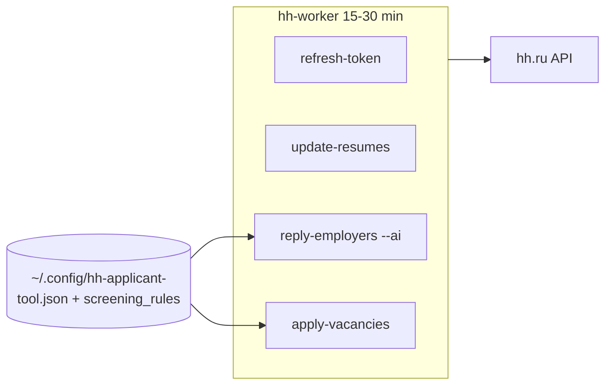

# HH screening + Telegram funnel + resume variants — design spec

**Дата:** 2026-06-28  
**Статус:** Approved (user)  
**Репозиторий:** [apply-hub](https://github.com/ilyayaya27/apply-hub) (ветка `it-ptitsa`)

---

## Цель

Поднять **конверсию в скрининг** на hh.ru (приглашения / ответы рекрутеров) с **переводом общения в Telegram**, без активной переписки на платформе.

Два связанных контура:

1. **Автопилот чатов hh** — мониторинг переговоров, AI-ответы по фактам резюме + правилам, в каждом ответе ссылка на TG.
2. **Варианты резюме** (~4 опубликованных) — клоны с перефразированными заголовками и формулировками (эффект «свежего резюме»), отклики со всех опубликованных.

---

## Решения пользователя

| Вопрос | Решение |
|--------|---------|
| Метрика успеха | Приглашения / ответы рекрутеров → **переход в Telegram** |
| Куда в TG | **A:** личный аккаунт — `https://t.me/ilyayaya27` (`@ilyayaya27`) |
| GitHub (контакты) | `https://github.com/ilyayaya27` |
| Автоматизация чатов | **1:** полный автопилот (без подтверждения) |
| Анкеты (ЗП, график, тестовое) | **A:** авто по резюме + **SSOT-правила** |
| Уведомления в TG | **Нет** — только `logs/worker.log` и hh |
| Архитектура | **Подход 1:** расширить `reply-employers` + конфиг, `spawn-resume-variants`, без отдельного сервиса |

---

## Текущее состояние

| Компонент | Сейчас |
|-----------|--------|
| `hh-worker.sh` | Цикл 15–30 мин: `refresh-token` → `update-resumes` → **`reply-employers`** → `apply-vacancies` |
| `reply-employers.sh` | **`--no-ai`**, статичный шаблон с устаревшим `@ilyasilkin27` |
| `reply_employers.py` | AI + контекст резюме; анкеты → `__SKIP__`; ответ только если последнее сообщение от работодателя |
| `clone-resume` | Клон без изменения текста |
| Контакты в репо | Разрозненно: `letter.txt`, `profile.yaml`, LinkedIn, Telegram channels — частично старый `@ilyasilkin27` / `github.com/ilyasilkin27` |

---

## In scope / Out of scope

| In scope | Out of scope |
|----------|--------------|
| SSOT: `telegram_username`, `telegram_url`, `github_url`, `screening_rules`, промпты чата | TG-бот для входящих от рекрутеров |
| AI `reply-employers` с правилами + TG в каждом ответе | Уведомления в Telegram |
| Убрать `__SKIP__` для анкет; ответ по правилам | Ответы когда последнее сообщение — не работодатель |
| `spawn-resume-variants` (клон + перефраз + publish) | Новые аккаунты hh |
| Обновить контакты TG/GitHub в SSOT-файлах | Массовая смена email/LinkedIn без запроса |
| `--dry-run` перед боевым режимом | Отдельный chat-worker / n8n |
| Unit-тесты pure-логики (prompt builder, rules formatter) | E2E против live hh API в CI |

---

## Архитектура (подход 1)



### SSOT контактов и правил

**Единый источник** — секция в конфиге hh-applicant-tool (`config.json`), читается Python-командами и **генерируется/синхронизируется** в производные файлы одной командой или при старте worker (минимум: Python читает config; shell `reply-employers.sh` не хардкодит строки).

```json
{
  "contacts": {
    "telegram_username": "ilyayaya27",
    "telegram_url": "https://t.me/ilyayaya27",
    "github_url": "https://github.com/ilyayaya27"
  },
  "screening_rules": {
    "salary_min_rub": 200000,
    "salary_comment": "обсуждаемо при интересном проекте",
    "work_format": "удалёнка, гибрид возможен",
    "test_task": "короткое — да; многочасовое бесплатное — нет",
    "notice_days": 14
  },
  "reply_chat": {
    "system_prompt": "…",
    "message_prompt": "…",
    "telegram_footer": "Удобнее в Telegram: https://t.me/ilyayaya27"
  }
}
```

Значения `salary_min_rub` и др. — **заполнить пользователем** при первом деплое; в spec — placeholders допустимы в example, не в production config.

### Поведение `reply-employers`

1. Только чаты, где **последнее сообщение от работодателя** (без изменений).
2. Контекст AI: резюме negotiation + **`screening_rules`** + последние 10 сообщений.
3. **Анкеты:** отвечать по правилам; **не выдумывать** факты; при отсутствии данных — нейтрально + «обсудим в Telegram».
4. **Каждый ответ** заканчивается `telegram_footer` (URL или @username из SSOT).
5. Без дублирования в TG; лог в `logs/worker.log`.
6. `reply-employers.sh` → **`--use-ai`**, без статичного `--reply-message` (или fallback template только если AI недоступен — опционально, по умолчанию skip).

### `spawn-resume-variants`

1. Источник: первое опубликованное резюме или `--resume-id`.
2. `--count 3` (итого ~4 с базовым): `clone-resume` → GET полного резюме → AI перефраз **title**, **skills/about**, **experience.description** (даты, компании, стек — без изменения фактов).
3. Обновление через API профиля резюме (тот же путь, что `create-resume` / `resume_profile`).
4. `publish` каждого варианта.
5. `--dry-run`: только вывод diff текстов, без POST.
6. Проверка лимита резюме на аккаунте перед spawn.

### Синхронизация контактов

Обновить производные от SSOT (одним проходом в рамках реализации):

| Файл | Поле |
|------|------|
| `reply-employers.sh` | убрать хардкод REPLY |
| `letter.txt` | Telegram, GitHub |
| `platforms/apply/profile.yaml` | `contact.telegram`, github если есть |
| `platforms/linkedin/additionalQuestions.yaml` | Website / GitHub |
| `platforms/telegram/src/config/channels.json` | pitchTemplate (если не gitignored secrets) |

---

## Риски и смягчение

| Риск | Смягчение |
|------|-----------|
| AI обещает неверную ЗП | Жёсткий блок `screening_rules` в промпте; запрет выдумывать |
| HH бан за однотипные ответы | Вариативность через AI + `rand_text` где уместно |
| Лимит резюме | Проверка перед clone; ошибка с понятным текстом |
| Старые контакты в pitch | SSOT + grep в CI/docs checklist |

---

## Проверка перед prod

```bash
.venv/bin/python -m hh_applicant_tool reply-employers --use-ai --dry-run
.venv/bin/python -m hh_applicant_tool spawn-resume-variants --count 1 --dry-run
# затем без --dry-run по одному чату/варианту
systemctl --user restart hh-worker  # когда dry-run ок
```

---

## Связанные документы

- `GUIDE.md` — `reply-employers --ai`
- `.claude/skills/hh-clicker/SKILL.md`
- `docs/superpowers/plans/2026-06-28-hh-screening-telegram.md` — план реализации
