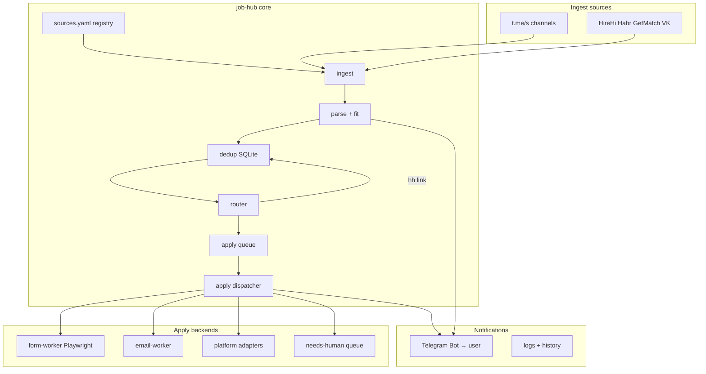

# Job Hub — автоматизация откликов (design spec)

**Дата:** 2026-06-24  
**Статус:** Approved (user)  
**Эволюция:** `rvc-applicant` → **job-hub** (рабочее имя; репозиторий пока `rvc-applicant`)

---

## Цель

Максимально автоматизировать поиск и отклик на вакансии по всем источникам из Buildin SSOT, **кроме уже работающих HH.ru и LinkedIn**. Единый SSOT для письма/профиля, dedup, скоринг, авто-apply где возможно, **уведомления пользователю в Telegram** (очередь, успех, ошибка, needs-human, дайджест).

---

## В scope / Out of scope

| In scope | Out of scope (не трогать) |
|----------|---------------------------|
| Telegram-каналы/боты из таблицы Buildin | **hh.ru** — `hh-applicant-tool`, `hh-worker.service` |
| HireHi, Habr Career, GetMatch, VK Careers | **LinkedIn** — `li-easy-apply`, `li-worker` |
| Email / Google Form / Typeform отклики из постов | **Freelance** (Kwork, freelance-radar, …) |
| Уведомления в личный Telegram | **JobRadar** |
| Dedup между источниками (без двойных откликов) | Jobrockets (DNS dead — deprecated в реестре) |
| Buildin как реестр источников (ручной paste / API позже) | JobLeads tier: paid — только ingest+alert, без подписки |

---

## Решения пользователя

- **Уровень автоматизации:** full auto — отклик без подтверждения везде, где технически возможно и не нарушает лимиты.
- **HH / LinkedIn:** только читать `letter.txt`, не менять воркеры.
- **Уведомления:** дублировать важные события в Telegram пользователю (@ilyasilkin27 в письме; для notify — Bot API → chat_id).

---

## Архитектура



### Принципы

1. **SSOT:** `hh-applicant-tool/letter.txt`, один PDF резюме (путь в конфиге), `profile.yaml` (ключевые слова, исключения, min score).
2. **Не ломать HH/LI:** ссылки на hh.ru помечаются `route: hh`, в очередь apply не попадают; напоминание «уже покрыто hh-worker».
3. **Full auto с предохранителями:** лимиты per-day (global + per-route + per-platform), cooldown после captcha/403, blacklist URL/company, `MIN_FIT_SCORE` выше чем в semi-auto (рекомендация: 55+).
4. **Isolation:** ingest/parse/router — pure JS + тесты; apply — отдельные модули с integration tests на границе.

---

## Реестр источников (`sources.yaml`)

Каждая запись:

```yaml
id: easy_frontend_jobs
type: telegram_channel   # telegram_channel | platform | employer
url: https://t.me/easy_frontend_jobs
preview: easy_frontend_jobs   # t.me/s/{preview}
market: ru
priority: 1
automation_tier: ingest_auto   # ingest_auto | apply_auto | alert_only | deprecated
enabled: true
notes: ""
```

### Матрица (Buildin batch 2026-03-20)

| id | Источник | tier | Примечание |
|----|----------|------|------------|
| hh | hh.ru | **external** | hh-applicant-tool |
| linkedin | LinkedIn | **external** | li-easy-apply |
| hirehi | hirehi.ru | apply_auto | URL с encoded format=удалённо |
| getmatch | getmatch.ru | apply_auto | Playwright после разведки UX |
| habr | career.habr.com | apply_auto | Playwright + session |
| vk | team.vk.company | apply_auto | employer ATS |
| jobleads | jobleads.com | alert_only | paid |
| jobrockets | jobrockets.ru | deprecated | DNS fail |
| g_jobbot | t.me/g_jobbot | ingest_auto | preview если доступен |
| easy_frontend_jobs | t.me/easy_frontend_jobs | ingest_auto | |
| frontendnotam | t.me/frontendnotam | ingest_auto | отдельный парсер тегов |
| javascript_jobs | t.me/javascript_jobs | ingest_auto | |
| remote_it | t.me/remote_it | ingest_auto | |
| jobforjunior | t.me/jobforjunior | disabled | junior — не профиль |
| sparklesjobs | t.me/sparklesjobs | ingest_auto | |
| zarubezhom_jobs | t.me/zarubezhom_jobs | ingest_auto | |
| revacancy | t.me/revacancy | ingest_auto | уже в коде |

---

## Маршрутизация отклика (`router`)

Существующие routes в `lib/router.js` сохраняются:

| route | Full auto действие |
|-------|-------------------|
| `hh` | skip apply; optional TG notify «дубликат HH» (throttled) |
| `form` | form-worker: Playwright, шаблон полей + letter |
| `email` | email-worker: SMTP/sendmail |
| `rvc_bot` | открыть start URL → извлечь контакты → form/email/telegram |
| `telegram` | **needs-human** или web.telegram automation (phase 2, высокий риск) |
| `manual` | needs-human + TG notify с ссылкой на пост |

---

## Telegram-уведомления пользователю

### Конфиг (`credentials.env`)

```env
TELEGRAM_NOTIFY_BOT_TOKEN=...   # @BotFather
TELEGRAM_NOTIFY_CHAT_ID=...     # личный chat_id
NOTIFY_ON=match,applied,failed,needs_human,daily_summary
NOTIFY_THROTTLE_SEC=60
```

### События

| Событие | Когда | Пример текста |
|---------|-------|----------------|
| `match` | Новая вакансия в очереди (fit ≥ min) | `🆕 72 form | Senior React…` + URL |
| `applied` | Успешный auto-apply | `✅ form | Company | title` |
| `failed` | Ошибка apply | `❌ form | reason | URL` |
| `needs_human` | telegram/manual/captcha | `👤 Нужен вы: …` + кнопка-ссылка |
| `daily_summary` | 1×/день cron | found / applied / failed / queue |

Реализация: `lib/notify-telegram.js` (fetch Bot API `sendMessage`). `NOTIFY_CMD` в monitor остаётся fallback для desktop.

---

## Хранилище

Переход **state.json → SQLite** (`data/job-hub.db`):

- `vacancies` — id, source, external_id, url, title, company, fit_score, route, status
- `applications` — vacancy_id, applied_at, method, note, error
- `seen` — dedup keys
- `cooldowns` — platform/route until timestamp

Migration: скрипт импорта из `state.json`.

Dedup keys:

- Telegram: `{channel}:{postId}`
- Platform: `{platform}:{vacancy_id}`
- Fuzzy: hash(normalize(title) + normalize(company))

---

## Apply workers (фазы)

### Phase 1 — Multi-channel ingest + notify + full auto dispatch stub

- `sources.yaml` loader
- Monitor loop по всем enabled telegram channels
- `AUTO_APPLY=true` по умолчанию в example
- `lib/notify-telegram.js`
- Apply dispatcher: form/email — queue job; log «not implemented» → needs_human + notify

### Phase 2 — Form + email workers

- `workers/form-apply.js` — Playwright, профиль Chrome, field heuristics (name, email, message, resume upload)
- `workers/email-apply.js` — nodemailer или sendmail
- Integration test: fixture HTML form → fill (mock server or static HTML file)

### Phase 3 — Platform adapters

Порядок: **HireHi → Habr → GetMatch → VK**

Каждый адаптер:

- `adapters/{id}/search.js` — список вакансий
- `adapters/{id}/apply.js` — один отклик
- `adapters/{id}/session/` — cookies (gitignored)
- Feature test с recorded fixtures (contract), live smoke manual

### Phase 4 — Orchestration

- `systemd/job-hub-monitor.service` + timer
- Daily summary timer
- CLI: `scan`, `queue`, `apply-next`, `report`, `mark-applied`

---

## Safeguards (full auto)

| Параметр | Default | Описание |
|----------|---------|----------|
| `MAX_APPLIES_PER_DAY` | 15 | global |
| `MAX_FORM_APPLIES_PER_DAY` | 8 | |
| `MAX_EMAIL_APPLIES_PER_DAY` | 5 | |
| `MIN_FIT_SCORE` | 55 | |
| `APPLY_DELAY_MS_MIN/MAX` | 30s–120s | между откликами |
| `CAPTCHA_COOLDOWN_MIN` | 60 | pause route после captcha |
| `COMPANY_COOLDOWN_DAYS` | 30 | не повторять company+title |

Excluded keywords (из HH tool, SSOT `profile.yaml`): fullstack-only, golang, php, bitrix, QA-only, etc.

---

## Тестирование

По правилам ptitsa-tdd + integration-testing:

| Граница | Тест |
|---------|------|
| ingest HTML → posts | `ingest.test.js` (fixture per channel) |
| parse + fit | unit |
| router | unit |
| dedup SQLite | integration |
| notify telegram | mock fetch Bot API |
| form apply | Playwright against local static form HTML |
| platform adapter | contract JSON snapshot + optional live smoke |

Перед каждым коммитом: «есть ли тест, пересекающий границу?»

---

## Файловая структура (target)

```
rvc-applicant/
  sources.yaml
  profile.yaml
  data/job-hub.db
  lib/
    config.js          # + sources, notify, limits
    ingest.js          # multi-channel
    notify-telegram.js
    store-sqlite.js    # replaces state.json
    apply-dispatcher.js
  workers/
    form-apply.js
    email-apply.js
  adapters/
    hirehi/
    habr/
    getmatch/
    vk/
  monitor/run.js
  docs/superpowers/specs/  # this file
  docs/superpowers/plans/  # next: implementation plan
```

---

## Риски

| Риск | Митигация |
|------|-----------|
| Ban Telegram / платформ | лимиты, delays, session profile |
| UI change | adapter tests + alert on failure |
| Мусорные отклики | fit score + exclusions |
| Дубли с HH | route hh + dedup by URL |
| Private TG channels | needs_human; user joins manually |

---

## Success criteria

1. Все enabled TG-каналы из реестра poll'ятся без ручного `scan`.
2. Full auto apply для `form` и `email` routes без участия пользователя (в пределах лимитов).
3. Каждый match/apply/fail/needs_human приходит в Telegram пользователю.
4. HH/LI воркеры не изменены; letter.txt — единственный источник текста.
5. `npm test && npm run test:feature` зелёные; integration tests на ingest и notify.

---

## Next step

После review этого spec → **writing-plans** → `docs/superpowers/plans/2026-06-24-job-hub-phase-1.md` (Phase 1 tasks).
